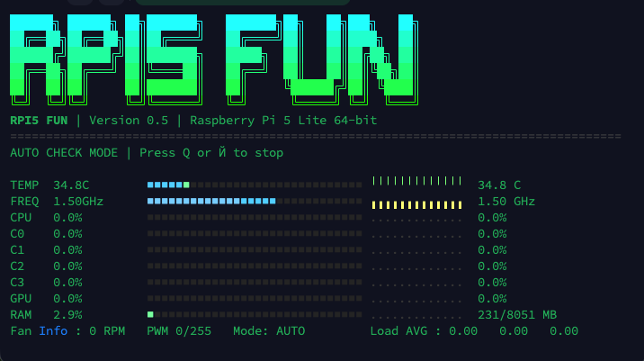
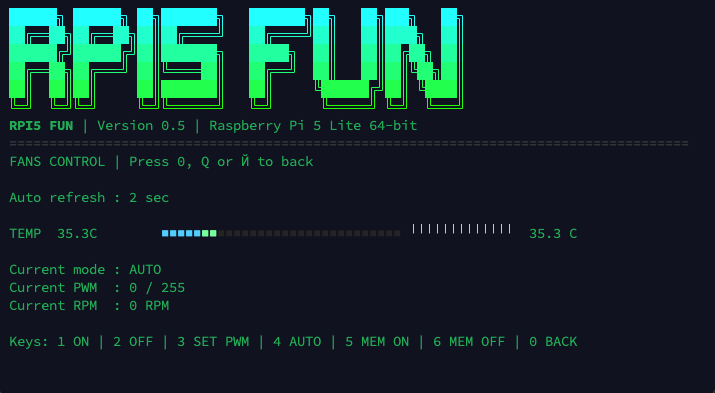

# RPI5 FUN


**Terminal dashboard and fan control utility for Raspberry Pi 5.**

RPI5 FUN gives you a fast SSH-friendly monitor for CPU temperature, CPU frequency, per-core load, GPU load, RAM, load average and fan state, plus direct manual PWM control and auto/manual switching in one terminal app.

**Copy -> paste -> run**

```bash
git clone https://github.com/DeziXsteroid/Raspberry-Fans-Control.git && cd Raspberry-Fans-Control && chmod +x run.sh && ./run.sh
```

**What this command does**

- clones the repository
- configures the project with CMake
- builds the binary
- starts `Raspberry_Fun_Control`

**Project preview**




**Why this project is cool**

- live terminal UI that works well directly on Raspberry Pi and over SSH
- manual fan control with fixed PWM hold
- auto fan mode switch with proper manual release
- configurable system paths from inside the app
- one-command startup through `run.sh`
- source-only repository with no junk binaries

**Quick guide**

<details>
<summary><strong>Build manually</strong></summary>

```bash
cmake -S . -B build
cmake --build build -j"$(nproc)"
sudo ./build/Raspberry_Fun_Control
```

</details>

<details>
<summary><strong>Main menu</strong></summary>

- `1` Start Auto Check
- `2` Fans Control
- `3` Settings
- `4` Help And Info
- `5` Exit

</details>

<details>
<summary><strong>Auto Check controls</strong></summary>

- `Q` or `Й` stop live monitoring

</details>

<details>
<summary><strong>Fans Control keys</strong></summary>

- `1` full speed
- `2` fan off
- `3` set custom PWM value
- `4` auto mode
- `5` memory mode ON
- `6` memory mode OFF
- `0` back

</details>

**Features**

- CPU temperature, CPU frequency and total CPU usage
- per-core monitoring for Raspberry Pi 5 cores
- GPU usage support
- RAM usage with used and total memory display
- load average in the footer
- fan RPM, PWM and current control mode
- live history strip with low / medium / high visual levels
- runtime settings editor for Linux paths
- experimental GPIO memory mode

**Repository layout**

- `main.cpp` terminal UI, menus and live screens
- `Status_Sys.cpp` system metrics collection
- `FanControl_Sys.cpp` fan control logic
- `Temperature_Sys.cpp` CPU temperature reader
- `Paths_Sys.h` default paths and startup settings
- `run.sh` one-command build and launch helper

**Requirements**

- Raspberry Pi 5
- Debian or Raspberry Pi OS 64-bit
- `cmake` 3.10+
- C++14 compiler
- `sudo` access for fan control operations

**macOS note**

You can edit, maintain and publish this repository from macOS without shipping extra binary files.

- no DLL files are needed
- no Linux binaries should be committed
- GitHub should contain source code, scripts, screenshots and docs only
- the project is compiled on Raspberry Pi or another Linux machine

**License**

This repository includes the MIT License.
